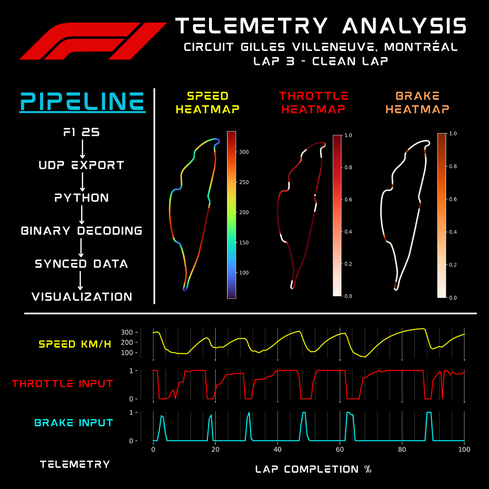

\# RaceLab F1 Telemetry

This is a Python UDP telemetry fetching and analysis project for F1 2025.

\## Project Goal

This project records UDP telemetry from F1 25 from me driving around circuit, stores driving data, and analyzes lap performance using Python

\## Current Scope

\- Capture UDP packets from F1 2025

\- Fetch and save raw packet data

\- Parse useful telemetry channels

\- Analyze speed, brake and throttle

\## Tools

\- F1 25

\- Python

\- UDP sockets

\- Pandas
